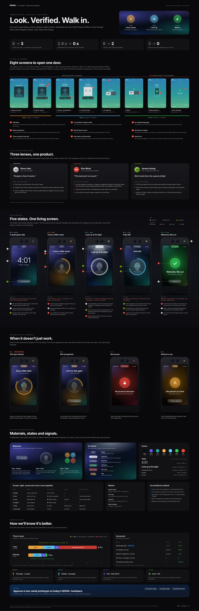

# NOVA+ Iris Reader: Liquid Glass redesign

**Look. Verified. Walk in.** One calm Liquid Glass surface replaces the eight screens the NOVA+ iris reader shows today. The board is written as a CPO review and uses three chief-designer lenses: Jobs, Musk and Huang.

| File | What it is |
|---|---|
| [`NOVA-Iris-Reader-LiquidGlass.svg`](NOVA-Iris-Reader-LiquidGlass.svg) | The Figma board, 3240 × 9915, all vectors |
| [`preview.jpg`](preview.jpg) | Half-scale render of the board |
| [`build_board.py`](build_board.py) | Generator; edit the copy or tokens and re-run |



## Open it in Figma

1. Drag the `.svg` onto a Figma canvas (or **File → Import**).
2. It arrives as one frame. Sections and scenes are named groups, for example `Scene 02 · Look · Look up at the light › Screen 416×666 › Iris Island · Look here`.
3. Text stays editable and is set in **Inter**, which ships with Figma. Swap it for **SF Pro** in production.
4. The glass effects use the same filter chains Figma exports, so drop shadows, inner shadows and layer blurs come back as native effects. The file has no raster images, no `foreignObject` and no scale transforms.

Screens are drawn at 416 × 666 pt (5:8 panel). The hardware frame shows the iris camera above the screen, because that's where the person has to look.

## What the recording shows

Source: on-device recording, 9 Oct 2026, on-screen clock 16:01:15–16:01:24, two passes. Timings were measured frame by frame at 10 fps.

| # | Screen today | On screen for |
|---|---|---|
| 1 | Position face here · "Scanning iris…" | 1.0 s |
| 2 | Please look up · *Too far, move closer* · 97 cm gauge · 00:19 countdown | 1.3 s+ |
| 3 | Please look up · *Good distance, hold still* · 43 cm | 0.4 s |
| 4 | Live IR face feed · "Keep both eyes inside the guides" · debug `N:1 G:00` | 0.4 s |
| 5 | Iris captured · left/right iris photos · right eye "Not captured" | 0.3 s |
| 6 | Green tick next to "Not captured" | 1.2 s |
| 7 | Welcome Ma Lun + a drawing of the device | 1.4 s |
| 8 | Door Unlocked · Please proceed. | 2.0 s |

**The engine is fast and the choreography is slow.** In pass 2 the reader went from face detected to iris matched in **2.1 s**. In pass 1, "Door Unlocked" appeared **2.6 s after** the person was already verified.

## The redesign

**Three moments on one living screen**, plus a calm resting state:

| State | Instruction | Replaces |
|---|---|---|
| 00 Ready | *Look up to enter* | (nothing today; the reader has no resting state) |
| 01 Find | *Come a little closer* | Position face · Too far · 97 cm gauge · countdown |
| 02 Look | *Look up at the light* | Please look up · camera hint · good distance · live IR feed |
| 03 Look | *Hold still* | Iris captured · countdown · iris photos · Not captured |
| 04 Enter | *Welcome, Ma Lun* | Tick · Welcome + device drawing · Door Unlocked |

The design rests on three components:

- **Iris Island.** A Liquid Glass capsule docked directly under the iris camera. It is the gaze target, so reading the instruction beneath it means looking at the camera. This fixes the split gaze in today's flow.
- **Tick ring.** One ring does every job. It is the distance gauge (amber), then the lock (white), then capture progress (cyan), and finally it collapses into the green medallion. No centimetres, no countdown.
- **Medallion.** Tick, welcome and unlock land as one moment, fired at the match.

The board also covers four unhappy paths (one eye missed, which happens in the recording; not recognised, with fingerprint fallback; no access; airlock in use). It includes the Liquid Glass system (materials, Island states, colour, type, motion), the multisensory state machine (screen, status light, sound and voice), accessibility rules, the time-to-door latency budget, a scorecard and a rollout plan.

### Headline numbers

| | Today | Redesign |
|---|---|---|
| Screens per pass | 8 | 3 moments on one screen |
| Wait between match and "Door unlocked" | 2.6 s | 0 s (in parallel) |
| Things to read while being guided | 6 | 2 |
| Raw face / iris images on screen | 3 | 0 |
| Time to door (target p50) | ≈ 4.7 s | ≤ 1.5 s (1.3 s budget) |

## The chief-designer lenses

| Lens | Signature idea | What it changed |
|---|---|---|
| **Steve Jobs** (focus & delight) | "Design is how it works." | One instruction per screen, five words or fewer. Guidance sits where the eyes must go. The flow ends on a feeling: bloom, chime and light together. |
| **Elon Musk** (first principles) | "The best part is no part." | Ten parts deleted. The unlock fires at the match. One number rules every release: time to door. |
| **Jensen Huang** (real-time AI) | Work back from the speed of light. | A 60 fps perception loop. The UI shows the AI working but never the data (no biometric pixels). Everything runs on the device, with a latency budget per stage. |

Lenses are a thinking tool drawn from each leader's publicly stated principles. No affiliation or endorsement is implied.

## The ask

Approve a two-week prototype on today's NOVA+ hardware. It needs no new sensors and no new matching engine. The only integration change is to signal the unlock at the match, in parallel with the welcome.

## Regenerate

```bash
pip install fonttools          # exact Inter metrics for text wrapping (optional)
python3 nova-iris-ux/build_board.py
```

Without fontTools or Inter installed, the generator falls back to estimated text widths.

**Privacy note:** the "today" screens are redrawn as low-fi replicas. The board contains no frames from the recording and no biometric imagery.
